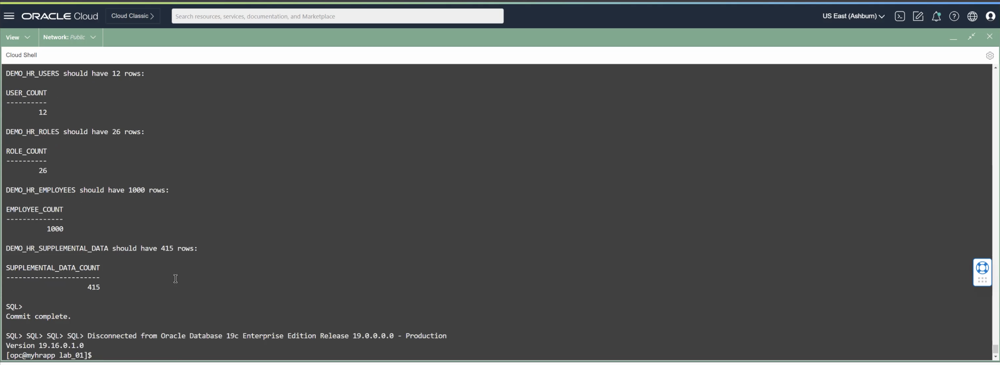
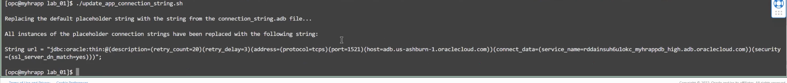
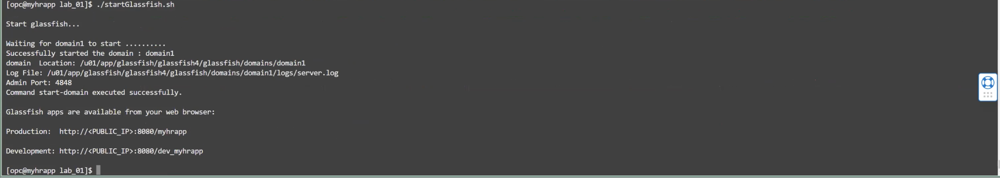
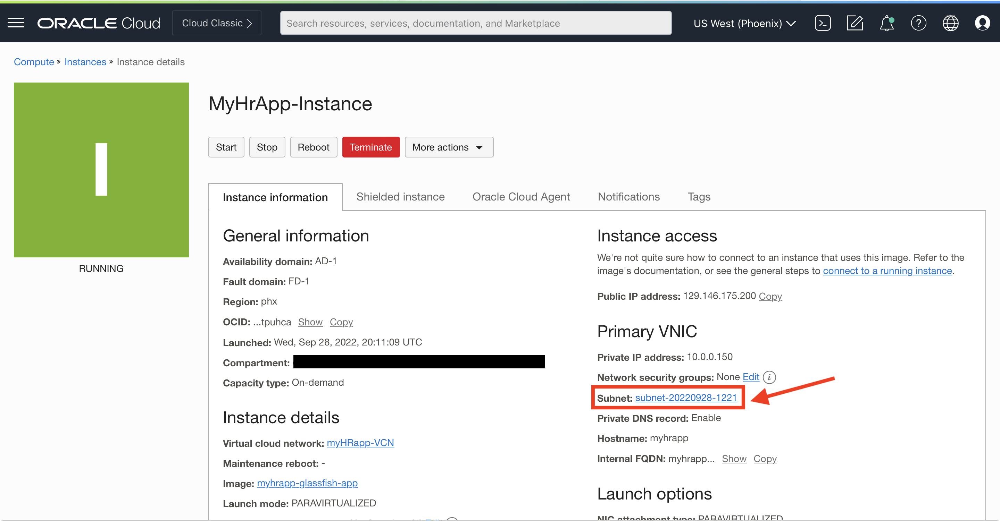
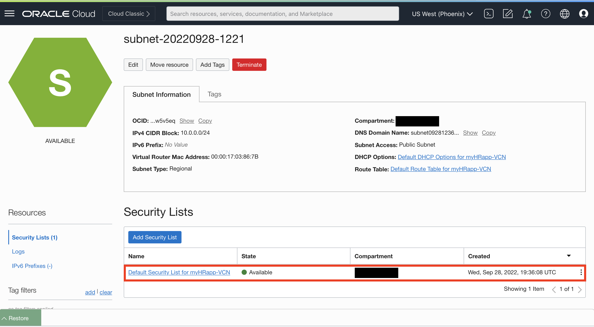
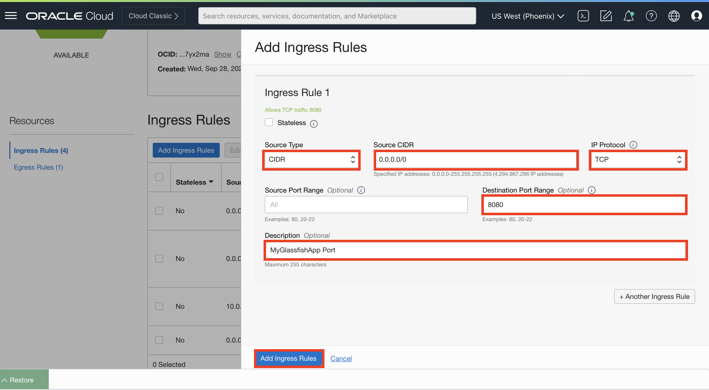
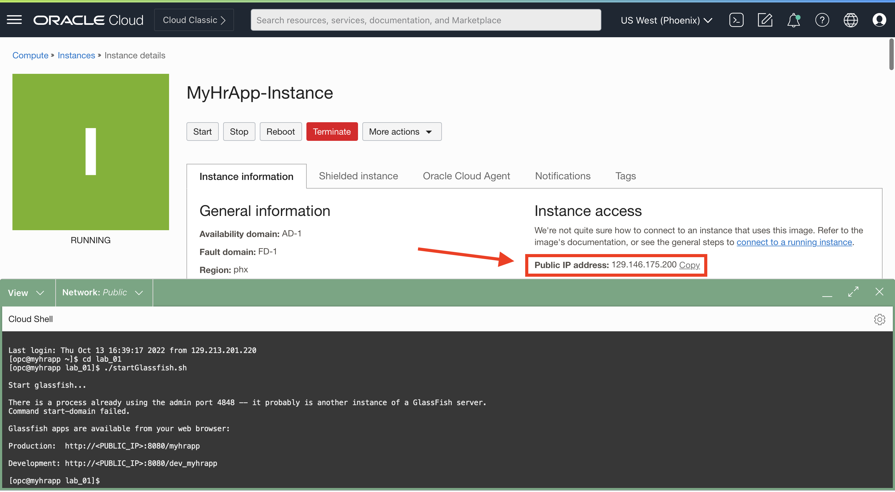
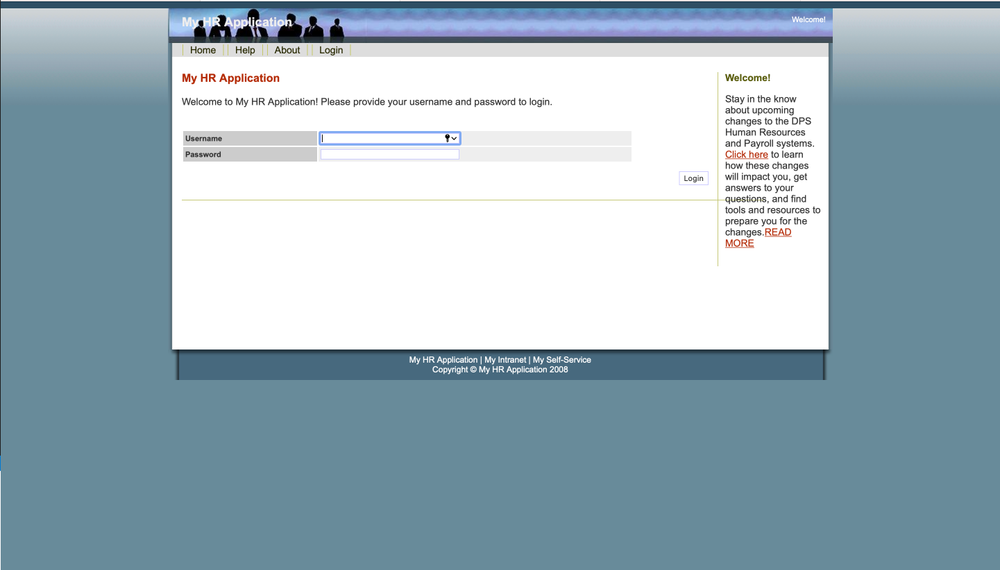

# Load and verify the data in the Glassfish application

## Introduction

In this lab, we will populate the Glassfish application with data and then verify that the HR application still functions appropriately. This will involve loading the `EMPLOYEESEARCH_PROD` schema objects to the ATP instance.

<!---
**Download the data lab files:** [Link](https://objectstorage.us-ashburn-1.oraclecloud.com/p/tVAwp-XWRsm1oouSHDzzZwyUQ5TErSPpPNhuYPMTbSJOZlC-Pvsed-caGfHYrkV5/n/orasenatdpltsecitom03/b/Twitter_LL/o/Twitter_LL2.zip)
-->

### Objectives

In this lab, you will complete the following tasks:

- Create the `EMPLOYEESEARCH_PROD` schema using `SQL*Plus` from the Glassfish App Server.
- Update the connection string.
- Start the Glassfish application.
- Verify the HR app functions using the Glassfish app **public IP**.

### Prerequisites

This lab assumes you have:
- An Oracle Always Free/Free Tier, Paid or LiveLabs Cloud Account

## Task 1: Create the EMPLOYEESEARCH_PROD schema using SQL*Plus from the Glassfish App Server.

1. Use the `load_app_data.sh` script to load data into your ATP instance.

    ```
    <copy>./load_app_data.sh</copy>
    ```

    

## Task 2: Update the connection string.

1. Update the application connection string using the `update_app_connection_string.sh` script.

    ```
    <copy>./update_app_connection_string.sh</copy>
    ```

    

## Task 3: Start the Glassfish application.

1. Start the Glassfish application using the `startGlassfish.sh` script.

    ```
    <copy>./startGlassfish.sh</copy>
    ```

    

## Task 4: Verify the HR app functions using the Glassfish app public IP.

1. Minimize your cloud shell terminal and navigate back to you Glassfish app instance in OCI using the hamburger menu under **Compute > Instances**.

    

2. Under the section **Primary VNIC**, select the subnet it created for you.

    

3. Under security lists, select the **default security list** for your subnet.

    

4. Under ingress rules, select **Add Ingress Rules**.

5. Fill in the information according to the image below and select **Add Ingress Rules**.

    

2. Navigate back to your cloud shell terminal. Locate the output of the `startGlassfish.sh` script and find the **production** URL given to you at the conclusion of the output. You may also copy it from clipboard below. Make sure to fill in the URL with the instance **public IP**.

    ```
    <copy>http://<PUBLIC_IP>:8080/myhrapp</copy>
    ```

    

    


You may now **proceed to the next lab.**

## Acknowledgements

- **Author** - Ethan Shmargad, North America Specialists Hub
- **Contributers** - Richard Evans, Senior Principle Product Manager
- **Last Updated By/Date** - Ethan Shmargad, September 2022
